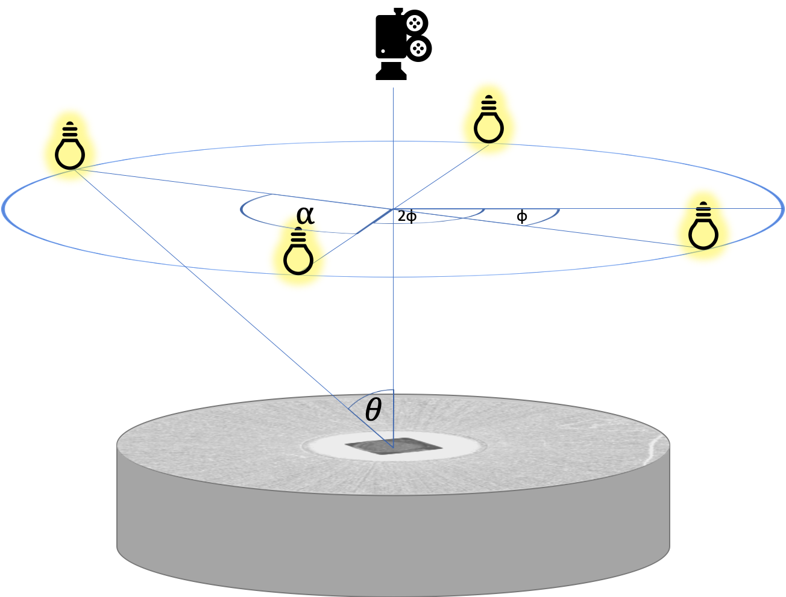
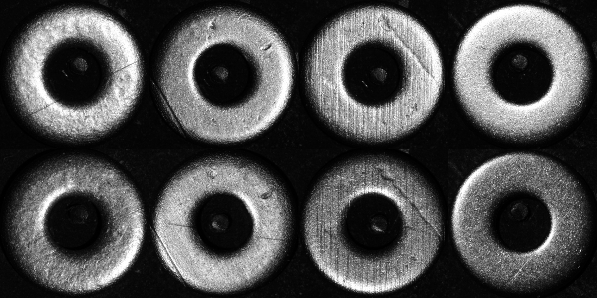

# Illumination-Preserving Rotations

This is an implementation of the [Defect Segmentation for Multi-Illumination Quality Control Systems](https://doi.org/10.1007/s00138-021-01244-z) article that presents a novel augmentation technique for multi-illumination datasets. 

## Multi-illumination datasets

In multi-illumination datasets, each sample is a multi-illumination image stack, where each image of this stack captures
the same sample under a different illumination angle. These angles often share the same elevation (θ), while
the azimuths (φ) are angularly equidistant (α). 
The stack might contain multiple different elevations (θ), however, the number of azimuths in each elevation must 
be consistent throughout the dataset. 
Images in the sack are stacked along the channel dimension forming an array of the shape 
`height, width, nr_illuminations*nr_channels`.



We present three multi-illumination datasets -- gears, screws, and washers, which were captured when illuminated from 12 different azimuths 
on each one of the 9 elevation angles. (Total 108 images per sample)

### Gears

### Screws

### Washers


To access the datasets, please visit: https://doi.org/10.5281/zenodo.5513768 (for the time being, only the washers dataset is available)

## Illumination-preserving rotations

The main operation our paper presents is the illumination-preserving rotation. The core idea is to rotate the images
only by multiples of α (i.e. the angle between two adjacent illumination directions) and roll the images in the 
stack so that the illumination angle always corresponds to the index of an image in the stack.

e.g. if α == 90
```python
import numpy as np
def illumination_preserving_rotation(image_stack): #shape [height, width, nr_illuminations]
    nr_illuminations = image_stack.shape[-1]
    k = np.random.randint(4)
    ids = np.roll(np.arange(nr_illuminations), k * nr_illuminations // 4)
    return np.rot90(image_stack, k=k)[..., ids]
```

Note that if there are multiple elevations (e.g. 2), we order the channels so that we first iterate over all elevations before moving to the next azimuth angle.
Example for two elevations: (θ_1, φ_1.1), (θ_2, φ_2.1), (θ_1, φ_1.2), (θ_2, φ_2.2), ...

## Defect detection
Our main objective is to use the multi-illumination image stacks for defect detection. The main idea is that the defects
are usually visible in a few of these images and therefore using many of them improves the performance. 
*Note: In the paper, we show that using the raw data for input is superior to restoring the surfaces using 
photometric-stereo techniques.*


In the paper, we use the [U-Net](https://arxiv.org/abs/1505.04597) segmentation network for predicting the defects, 
but comparison to other architectures, such as [FCN](https://arxiv.org/abs/1411.4038),
[IterNet](https://arxiv.org/abs/1912.05763), or [DeepLabV3+](https://arxiv.org/abs/1802.02611v3), is also given.

## Implementation

We provide a data iterator and loader for the gears, screws, and washers datasets. As these were captured with α == 30, 
when using the illumination-preserving rotations, we preload the 30 and 60-degree rotations to memory and use then
only 90-degree rotations during training. 

## Training

Use the [train.py](train.py) file in the following way to start the training:
```bash
python train.py --dataset_path=path/to/the/dataset/such/as/Gear/ 
```
Use the arguments to change the architecture, augmentation, regularization, or dimensionality reduction.
Use the `--rotation` to select the rotation-based augmentation, and optionally use `--no_illum_pres` if you desire to
turn off the illumination-preserving rotations and use the standard rotations instead.

The code comes in two variants -- custom training loop and simplified keras training loop
(in the paper, we have used a variant with the custom training loop). To select the simplified variant use
`--keras_only` option, but beware that this variant is not yet fully tested.

### Training with normal maps
If you are in the possession of the normal maps extracted from the raw images by an external algorithm, you can use:
```bash
python train_normals.py --dataset_path=path/to/the/dataset/such/as/Gear/ 
```
to train the models. In this script there is no option for illumination preserving rotations and only standard
rotations are applied. 
The data have to be in the .mat file format and stored in the variable named `Normals_est`.  

## Reference

If you find this work useful, please cite:
```
@article{honzatko2021defect,
  title={Defect segmentation for multi-illumination quality control systems},
  author={Honz{\'a}tko, David and T{\"u}retken, Engin and Bigdeli, Siavash A and Dunbar, L Andrea and Fua, Pascal},
  journal={Machine vision and Applications},
  year={2021},
  volume={32},
  number={118},
  publisher={Springer}
}
``` 
